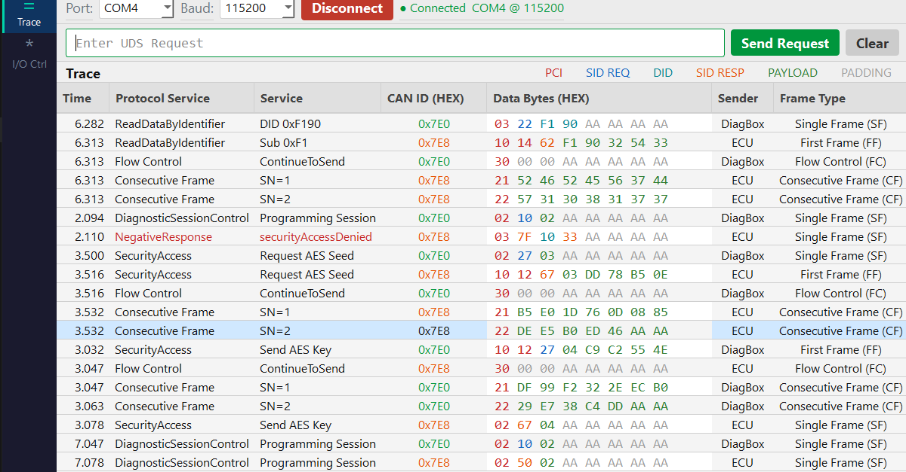

# SIGMA UDS Bootloader

> UDS/ISO-TP diagnostic stack on STM32F411RE — 6 ISO 14229 services, AES-ECB-128 security access, and a PyQt5 diagnostic host (DiagBox)

---



---

## Architecture

```
┌─────────────────────┐        UART 115200        ┌─────────────────────┐
│   SIGMA DiagBox     │ ◄────────────────────────► │   STM32F411RE ECU   │
│   (PyQt5 Host)      │     ISO-TP / UDS frames    │   (Firmware in C)   │
└─────────────────────┘                            └─────────────────────┘
```

---

## UDS Services Implemented

| SID  | Service                          | Notes                                    |
|------|----------------------------------|------------------------------------------|
| 0x10 | DiagnosticSessionControl         | Default / Programming session            |
| 0x11 | ECUReset                         | SW / HW / KeyOffOn reset                 |
| 0x22 | ReadDataByIdentifier             | Serial number, HW/SW version, session    |
| 0x27 | SecurityAccess                   | XOR seed/key + AES-ECB-128 high security |
| 0x31 | RoutineControl                   | Erase memory, integrity check            |
| 0x2F | InputOutputControlByIdentifier   | LED, Buzzer, Fan (PWM), Relay            |

---

## ISO-TP Transport (ISO 15765-2)

8-byte UART frames — full multi-frame support:

| Frame | PCI    | Description                      |
|-------|--------|----------------------------------|
| SF    | `0x0N` | Single Frame (payload ≤ 7 bytes) |
| FF    | `0x10` | First Frame (payload > 7 bytes)  |
| CF    | `0x2N` | Consecutive Frame (sequence N)   |
| FC    | `0x30` | Flow Control (ContinueToSend)    |

Used for **SID 0x27 sub 0x03/0x04** — AES seed (18 bytes) and key exchange over multi-frame.

---

## Security Access — Two Levels

**Level 1 — Standard (0x27 0x01 / 0x02)**
- 2-byte seed generated from SysTick
- Key algorithm: `key = seed_H XOR seed_L`

**Level 2 — High Security (0x27 0x03 / 0x04)**
- 16-byte seed generated from SysTick
- Key algorithm: `key = AES_ECB_Encrypt(master_key, seed)`
- Transmitted via ISO-TP multi-frame (18 bytes)
- Max 3 attempts before lockout

---

## SIGMA DiagBox — PyQt5 Host

- Full ISO-TP framing engine (SF / FF / CF / FC auto-detection)
- Color-coded trace table (PCI / SID REQ / SID RESP / DID / PAYLOAD / PADDING)
- Frame type column (SF / FF / CF / FC)
- I/O Control dashboard — live gauges for Fan, Buzzer, Relay
- Serial port auto-detection and connection management

---

## Project Structure

```
├── Core/                        # STM32 HAL core
├── Drivers/                     # STM32 HAL drivers
├── SIGMA_User_Interface/
│   ├── SIGMA_UDS_Host.py        # PyQt5 diagnostic GUI
│   ├── SIGMA_IO_Control.py      # I/O dashboard widgets
│   ├── IOCControlPage.py        # I/O control page
│   └── aes_ecb_key.py           # AES-ECB-128 key calculator
├── Src/
│   ├── main.c                   # PCI decoder + main loop
│   ├── SIGMA_uds.c              # UDS service handlers
│   ├── SIGMA_iso_tp.c           # ISO-TP transport layer
│   └── SIGMA_io_control.c       # SID 0x2F I/O control
└── images/
    └── 1.PNG                    # DiagBox screenshot
```

---

## Hardware

| Component  | Detail                        |
|------------|-------------------------------|
| Board      | STM32F411RE Nucleo            |
| Interface  | UART2 @ 115200 baud (ST-Link) |
| LED        | PA5 — LD2 onboard             |
| Fan        | TIM2 CH2 — PWM 0–100%        |
| Buzzer     | TIM3 CH1 — PWM 0–100%        |
| Relay      | PB0 — GPIO                    |

---

## Requirements

```bash
pip install pyserial PyQt5 cryptography
```

---

## Author

**ARNOUZ SAID** — Embedded Systems Engineer